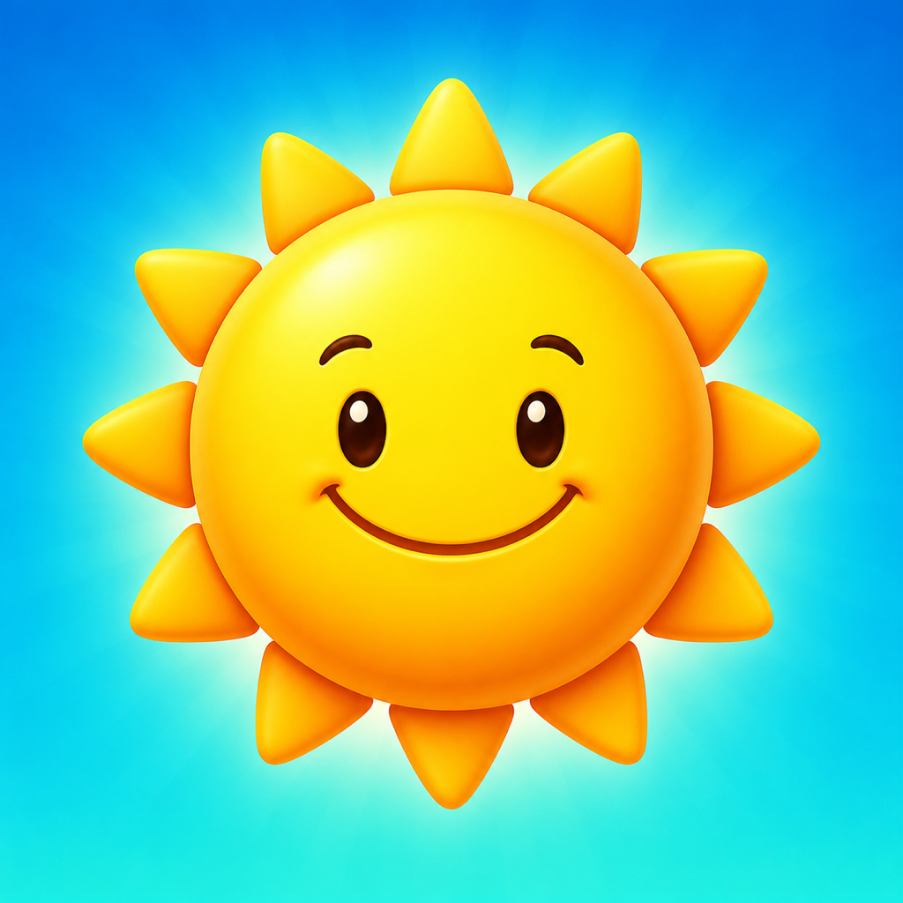
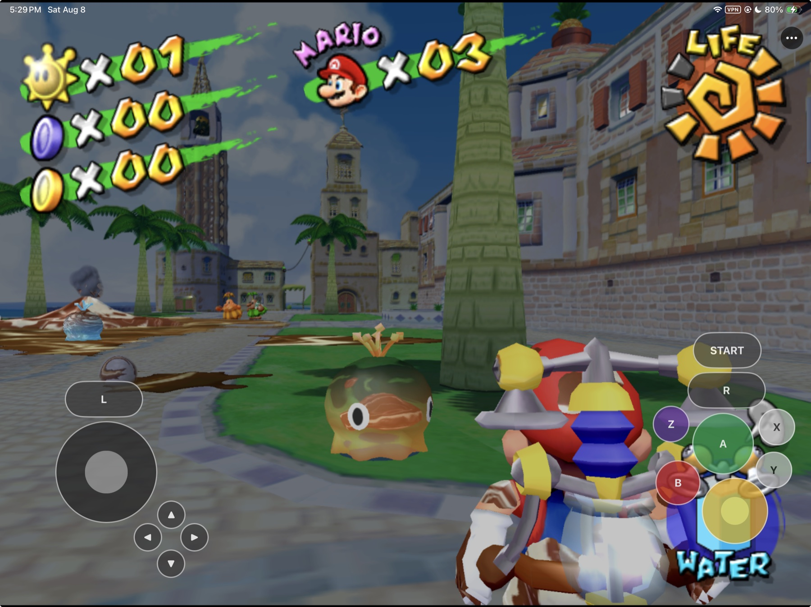
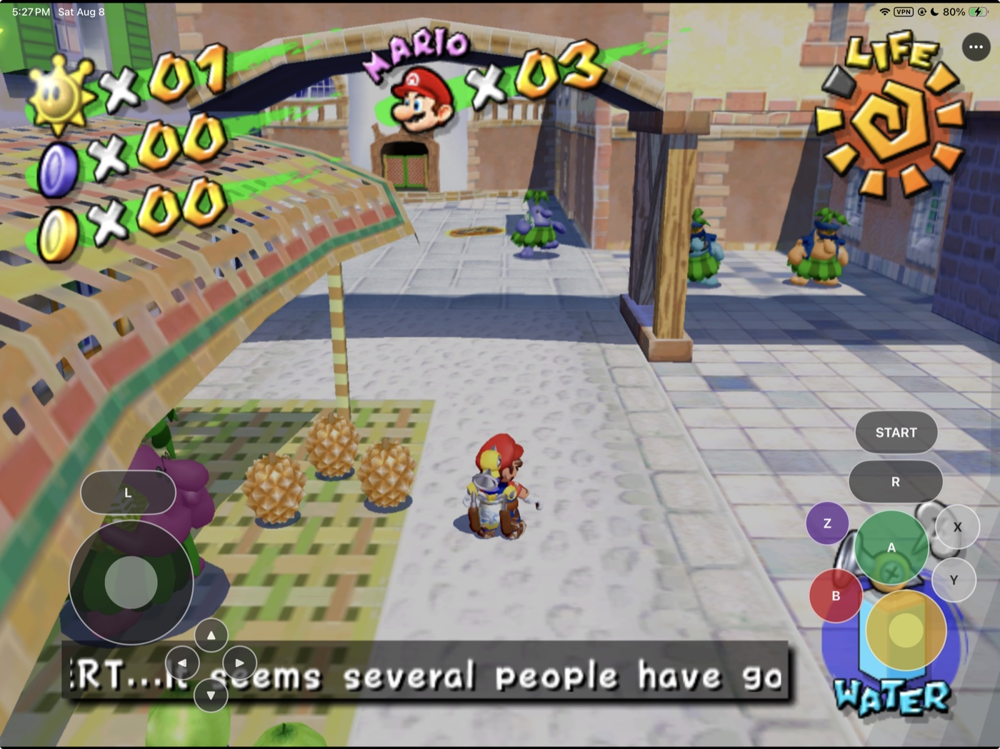
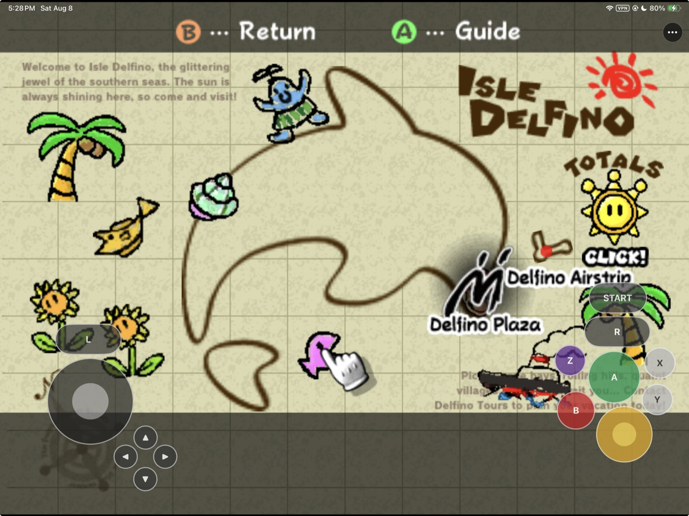

# SunPad

<p align="center">
  <strong>Super Mario Sunshine on iPhone and iPad through static recompilation and Metal.</strong><br>
  Native landscape rendering, touch controls, controller support, and Files-based game-data setup.
</p>

<p align="center">
  
</p>

<p align="center">
  
  
  
  
  
</p>



SunPad packages a native Apple ARM64 app around a
[DolRecomp](https://github.com/encounter/dolrecomp)-generated Super Mario
Sunshine module and the ModernGekko/Dolphin-derived compatibility runtime.
The original PowerPC code runs as ahead-of-time recompiled host code, without
a runtime PowerPC JIT, while Dolphin's Metal backend renders into the iOS app.

The app imports a user-provided supported GameCube image through Files,
extracts it on-device, and provides a landscape touch controller alongside
iOS GameController support. This repository contains the Apple integration,
patches, and reproducible tooling. It does **not** contain Super Mario
Sunshine, a GameCube image, extracted Nintendo assets, saves, or a generated
game module.

## Current status

| Area | Current result |
|---|---|
| Native app | Universal arm64 iPhone/iPad target for iOS and iPadOS 16+ |
| Rendering | Dolphin Metal backend reaches the title sequence and playable Delfino Plaza gameplay |
| Game setup | Files picker, GMSE01 validation, private retention, and on-device extraction work |
| Touch | Move stick, C-stick, D-pad, A/B/X/Y/Z, L/R, Start, and a persistent settings menu |
| Controllers | Touch and iOS GameController input merge through one normalized GameCube state |
| Settings | Live 1×–4× render scale, control opacity/size, hide-on-controller, and movable layouts |
| Audio | Guest-timebase defect fixed; continuous desktop and Simulator audio verified; fresh physical-device audio acceptance remains |
| Distribution | Source/development build only; no public IPA, TestFlight, or App Store release |

The current development build has been signed, installed, and played on a
12.9-inch iPad Pro (6th generation). Physical-device boot, Metal rendering,
Files import, on-device extraction, touch input, gameplay, and in-place app
updates have been exercised. See [the testing ledger](docs/TESTING.md) for the
dated evidence and the checks that remain.

## Get started

You need:

- an Apple Silicon Mac with Xcode 26.x and its command-line tools;
- CMake, Ninja, ripgrep, Git, and Python 3;
- an Apple ID configured in Xcode for physical-device signing; and
- your own legally obtained Super Mario Sunshine USA revision 0 image
  (`GMSE01`).

Clone the repository, place your local inputs under the ignored `ref/` tree,
and follow the exact extraction and recompilation steps in
[`docs/BUILDING.md`](docs/BUILDING.md).

Build the iOS Simulator core and app:

```sh
./scripts/ios-build-core.sh
xcodebuild -project SunPad.xcodeproj -scheme SunPad -configuration Debug \
  -destination 'platform=iOS Simulator,name=iPhone 17 Pro' \
  -derivedDataPath /tmp/sunpad-ddp build
```

Build for a physical iPhone or iPad:

```sh
./scripts/ios-build-core-device.sh
xcodebuild -project SunPad.xcodeproj -scheme SunPad -configuration Debug \
  -destination 'platform=iOS,id=<device-udid>' \
  -derivedDataPath /tmp/SunPadDerivedData \
  DEVELOPMENT_TEAM=<team-id> CODE_SIGN_STYLE=Automatic \
  -allowProvisioningUpdates build
```

Generated source trees, build products, GameCube data, saves, signing
material, and locally recompiled modules are ignored and must never be
committed.

## First launch

SunPad never downloads or bundles game data.

1. Launch SunPad and open the **•••** menu.
2. Choose **Game Data & Saves → Change or Reimport**.
3. Select your supported raw ISO/GCM image in Files.
4. Leave SunPad open while it validates and extracts the image locally.
5. Start playing when the game finishes booting.

SunPad validates the GameCube header and `GMSE01` game code before replacing
the retained image. The private copy and extracted tree stay in the app
container and are reused on later launches.

## Touch controls

SunPad uses a landscape layout designed separately for compact iPhones and
larger iPads:

- **Left:** movement stick, D-pad, and L within thumb reach.
- **Right:** camera stick, A/B/X/Y diamond, Z, R, and Start.
- **Menu:** the persistent **•••** button opens render, control, game-data,
  and save settings.
- **Customize:** Move mode lets controls be dragged and saves normalized
  positions per device class; Reset restores the default layout.
- **Controller handoff:** a connected physical controller can hide the touch
  overlay automatically.

Touch and GameController input merge through the same thread-safe GameCube
state. Button presses are edge-latched, the strongest stick input wins, and
analog triggers preserve FLUDD pressure control.

## Screenshots

<table>
  <tr>
    <td width="50%">
      
    </td>
    <td width="50%">
      
    </td>
  </tr>
  <tr>
    <td align="center"><strong>Playable on iPad</strong><br>Native Metal gameplay with the full touch layout.</td>
    <td align="center"><strong>Menus remain usable</strong><br>Every GameCube control stays available without a separate controller.</td>
  </tr>
</table>

All screenshots come from the current physical iPad development build using
game data supplied locally by the device owner. No game data or save is part
of this repository.

## Supported game data

| Game ID | Region | Revision | Status |
|---|---|---|---|
| `GMSE01` | USA | 0 | Initial supported target |

Raw ISO/GCM images are recognized. Compressed image formats and automatic
module matching remain hardening work. The development target SHA-256 is
recorded in [the legal and provenance boundary](docs/LEGAL_AND_PROVENANCE.md)
for identification; the image itself is never tracked or distributed.

## How the local pipeline works

```text
Your GMSE01 image on the Mac
        ↓
DolRecomp-generated ARM64 module + ModernGekko/Dolphin runtime
        ↓
Signed SunPad development app
        +
Your GMSE01 image selected through Files after installation
        ↓
Private on-device extraction → Metal rendering → local gameplay and saves
```

The compile path and first-launch import are deliberately separate. Building
the app never adds the retail disc image, extracted game files, or a user save
to the bundle.

## Frequently asked questions

### Does this repository include Super Mario Sunshine?

No. You must supply your own legally obtained supported GameCube image. Do
not open issues requesting game data or download links.

### Is SunPad a GameCube emulator?

No. SunPad is a game-specific static-recompilation integration. It combines a
locally generated `GMSE01` module with a Dolphin-derived compatibility runtime;
it is not a general-purpose loader for other GameCube games.

### Does it use a JIT on iPhone or iPad?

No runtime PowerPC JIT is used. The supported game's PowerPC code is
ahead-of-time recompiled for ARM64, with the runtime interpreter handling
unrecompiled regions.

### Can I download an IPA?

Not currently. The repository supports local development builds signed with
your Apple development team. No public IPA, TestFlight, AltStore, or App Store
release has been announced.

### Do saves survive an app update?

An in-place development install preserves the app container. Clean uninstall,
bundle-identifier changes, and some signing changes can remove or disconnect
local data, so back up the device container before changing those boundaries.
No save belongs in Git or a release artifact.

### Is everything finished?

No. The current build is playable and useful for development testing, but
physical-device audio re-acceptance, broader scene coverage, lifecycle/save
hardening, compressed image support, distribution packaging, and the native
macOS shell remain explicit work.

## Project map

| Path | Purpose |
|---|---|
| [`scripts/ios-build-core.sh`](scripts/ios-build-core.sh) | Build and provision the Simulator core/module |
| [`scripts/ios-build-core-device.sh`](scripts/ios-build-core-device.sh) | Build and provision the physical-device core/module |
| [`apple/ios/`](apple/ios/) | UIKit app shell, Files import, touch UI, and Apple adapter |
| [`patches/ModernGekko-dolphin/`](patches/ModernGekko-dolphin/) | Maintained upstream runtime fixes |
| [`docs/BUILDING.md`](docs/BUILDING.md) | Exact desktop, Simulator, and device build commands |
| [`docs/TESTING.md`](docs/TESTING.md) | Dated evidence and remaining acceptance gates |
| [`docs/KNOWN_ISSUES.md`](docs/KNOWN_ISSUES.md) | Current limitations and workarounds |
| [`docs/LEGAL_AND_PROVENANCE.md`](docs/LEGAL_AND_PROVENANCE.md) | Asset, game-data, attribution, and license boundary |
| `ref/` | Ignored local game data and pinned/generated source worktrees |

## Research and credits

The recompilation path follows the public ExpansionPak ecosystem: DolRecomp,
ModernGekko, ModernGekko-Template, RecompCore, and their contributors. Dolphin
provides the compatibility-runtime foundation and Metal backend. The
[doldecomp/sms](https://github.com/doldecomp/sms) project is used as a research
reference. See [`docs/RESEARCH.md`](docs/RESEARCH.md) and
[`docs/DEPENDENCIES.md`](docs/DEPENDENCIES.md) for pins and attribution.

## Legal

SunPad is an unofficial community project and is not affiliated with or
endorsed by Nintendo. Super Mario Sunshine, Nintendo, and GameCube names and
screenshots are used only to identify compatibility and demonstrate the
project. No disc image, extracted Nintendo asset, generated game-derived
module, or user save is included in the repository or a release. Each upstream
component retains its own license and copyright. See
[`docs/LEGAL_AND_PROVENANCE.md`](docs/LEGAL_AND_PROVENANCE.md).

## Contributing

SunPad is an experimental source project. The most useful contributions are
reproducible device reports against the checklist in
[`docs/TESTING.md`](docs/TESTING.md). Never attach game data, extracted assets,
generated modules, or saves to an issue or pull request.
